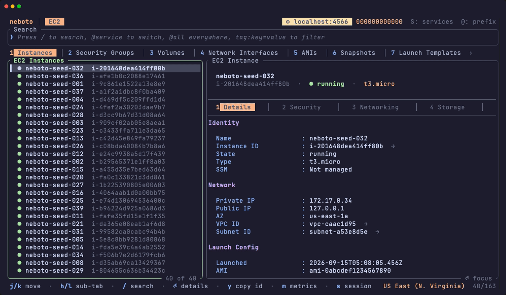

# neboto

A fast, keyboard-driven terminal UI for browsing AWS. **65 services**, rich
console-style detail panes, live log tailing, CloudWatch charts, and
cross-service link-following — all without leaving the terminal.

Built in Rust with [Ratatui](https://ratatui.rs/).

<p align="center">
  
</p>

https://github.com/user-attachments/assets/f7a4dee9-d38d-4624-b883-4df75489636d

**neboto is read-only.** It issues only `describe`/`list`/`get` calls. Nothing
it does can change your account, which is the point: it is safe to run against
production, and the IAM policy in [`PERMISSIONS.md`](./PERMISSIONS.md) is
auditably read-only. See [Why read-only](#why-read-only).

---

## Highlights

- **65 AWS services** behind an `@prefix` fuzzy search — `@ec2 web`, `@sh`,
  `@orgs`. Multi-resource services get numbered sub-tabs.
- **Console-style split detail panes** on ~160 resource types: fixed header,
  section tabs, scrollable body. Expensive sections load lazily on first view.
- **Follow the links** — press `Enter` on any ARN, id or reference to jump to
  that resource, across services and even across regions. Tracing a dependency
  chain is faster here than in the Console.
- **Live log tail** (`t`) and server-side **log search** (`f`) on log groups,
  Lambda, RDS, ECS tasks, WAF, CloudTrail, Step Functions, CodeBuild and more.
- **CloudWatch charts in the pane** (`m`) for 53 resource kinds, each with the
  right namespace and dimension set.
- **"Who changed this?"** (`W`) — a CloudTrail lens on *any* resource.
- **Multi-account** — switch profiles (`P`), or assume a role into an
  Organizations member account (`s`) scoped by a `ReadOnlyAccess` session
  policy so an assumed session provably cannot mutate.
- **Watch mode** (`w`) — auto-refresh without the list ever blanking.
- **Macros** (`,`) — record a navigation routine once, replay it with one key
  or from the CLI with `--macro`.
- **Themes** — 10 presets (light and dark) plus per-color overrides.
- **Export** (`X` / `Ctrl-X`) to JSON + CSV + Markdown, including deep exports
  of a multi-row selection.

---

## Install

Prebuilt binaries for Linux (x86_64, aarch64) and macOS (Intel, Apple
Silicon) are attached to every [GitHub release](https://github.com/neboto/neboto-tui/releases).

```bash
# installer: picks the right binary, verifies its SHA-256, puts it in ~/.local/bin
curl -fsSL https://raw.githubusercontent.com/neboto/neboto-tui/main/install.sh | sh

# or with cargo-binstall
cargo binstall --git https://github.com/neboto/neboto-tui neboto
```

`NEBOTO_VERSION=v0.1.0` pins a version and `NEBOTO_INSTALL_DIR` changes the
destination. Or grab the tarball for your platform from the releases page and
put `neboto` anywhere on your `PATH`.

**Verify a download.** Every release archive carries a signed [build
provenance attestation](https://docs.github.com/en/actions/security-for-github-actions/using-artifact-attestations)
naming the commit and workflow that built it. With the GitHub CLI:

```bash
gh attestation verify neboto-aarch64-apple-darwin.tar.gz --repo neboto/neboto-tui
```

A tampered or substituted archive fails this check even if its `.sha256`
was replaced alongside it.

**From source** — needs a recent stable Rust toolchain:

```bash
cargo install --git https://github.com/neboto/neboto-tui
# or
git clone https://github.com/neboto/neboto-tui.git && cd neboto-tui
cargo build --release && ./target/release/neboto
```

Either way you need configured AWS credentials. Optional companions: the
`aws` CLI + `session-manager-plugin` for SSM sessions (`s`), and a `$EDITOR`
for `e`. How releases are cut is in [`docs/RELEASING.md`](./docs/RELEASING.md).

### Command line

Every flag overrides the config file for that run only.

| Flag | Effect |
|---|---|
| `-s`, `--service <SERVICE>` | Open a service on startup (`ec2`, `s3`, `@cw`, …) |
| `-r`, `--region <REGION>` | Start in this region |
| `-p`, `--profile <PROFILE>` | Use this named AWS profile |
| `-w`, `--watch` | Start in watch mode (auto-refresh) |
| `-m`, `--macro <NAME>` | Run a saved macro on startup |
| `--theme <THEME>` | Color preset (see [Themes](#themes)) |
| `--endpoint-url <URL>` | Point at a local emulator |
| `--banner` / `--no-banner` | Show or hide the ASCII banner |

With no arguments and no `default_service` configured, neboto shows a welcome
splash and loads nothing until you pick a service — so startup is instant.

---

## Layout

```
┌────────────────────────────────────────────────────────────────────────────┐
│  neboto │ EC2 │ VPC │ S3 │ IAM        ⇄ prod (123456789012)  ⦿ default  ‹› │
├─── Sub-tabs ───────────────────────────────────────────────────────────────┤
│  1 Instances  2 Security Groups  3 EBS  4 ENIs  5 AMIs  6 Snapshots  ›     │
├─── Search ─────────────────────────────────────────────────────────────────┤
│  ❯ @ec2 web                                                                │
├──────────────────────────┬─────────────────────────────────────────────────┤
│  Resource list (40%)     │  Split detail pane (60%)                        │
│                          │                                                 │
│  ● i-0abc123  web-srv    │  web-server-prod                                │
│    i-0def456  api-srv    │  i-0abc123def456  ·  ● running  ·  t3.medium    │
│                          ├─────────────────────────────────────────────────┤
│                          │  1 Details 2 Security 3 Networking 4 Storage …  │
│                          ├─────────────────────────────────────────────────┤
│                          │  Security Groups                                │
│                          │    Group              sg-0abc123  web-servers → │
│                          │    IAM Role           app-server-role         → │
├──────────────────────────┴─────────────────────────────────────────────────┤
│  j/k move  l details  / search  m metrics  t logs  W trail  ? help  q quit │
└────────────────────────────────────────────────────────────────────────────┘
```

A `→` marks a row you can press `Enter` on to follow. `Z` makes the detail pane
full-width; `\` flattens all sections into one scroll.

---

## Keybindings

`?` opens the in-app help, which is the authoritative list. The essentials:

### Context

| Key | Action |
|---|---|
| `S` / `R` / `P` | Service / region / profile picker (work from either pane) |
| `@` | Search bar seeded with `@`, for a fast service switch |
| `/` | Fuzzy search the current service |
| `r` / `F5` | Refresh — whole service from the list, just this resource from the detail pane |
| `w` | Watch mode (auto-refresh); `+` / `-` tune the interval |
| `,` | Macros — `⏎` run, `n` record, `,` again to stop recording |
| `` ` `` | Jump list (navigation history) |
| `B` / `'` | Bookmark this location / open bookmarks |
| `M` | Message history (past errors and toasts, `y`-copyable) |
| `\` | Toggle flat detail view (all sections in one scroll) |
| `b` / `?` / `q` | Banner / help / quit |

### List pane

| Key | Action |
|---|---|
| `j` `k` `↑` `↓` | Move |
| `gg` / `G` | Top / bottom |
| `Ctrl-d` / `Ctrl-u` | Half page |
| `l` `→` `⏎` | Open the detail pane |
| `h` `←` `⌫` `Ctrl-O` | Back through history |
| `Tab` / `Shift-Tab`, `1`–`9`, `0` | Switch sub-tab |
| `a` | Hide noisy rows (defaults, automated snapshots, passed checks…) |
| `z` | Cycle sort — load order → name ↑ → name ↓ → state |
| `F` | Cycle a filter over the states present in this view |
| `V`, `J` / `K` | Visual row selection; `Ctrl-A` selects all |
| `y` | Copy the id/ARN — or the selection as a Markdown table |
| `C` | Copy the equivalent read-only AWS CLI command |
| `X` / `Ctrl-X` | Export |

### Detail pane

| Key | Action |
|---|---|
| `j` `k`, `gg` / `G` | Scroll |
| `Tab` / `Shift-Tab`, `1`–`9` | Switch section |
| `[[` / `]]` | Previous / next group header |
| `l` `→` `⏎` | Follow the link under the cursor |
| `h` `←` `Esc` `Ctrl-O` | Back |
| `/` | Filter the body text |
| `y` / `c` | Copy the row, or the visual selection |
| `e` | Open in `$EDITOR` |
| `d` | Download (Lambda deployment package, invoice PDF) |
| `Z` | Full-width pane |

### In-pane views

Each takes over the keymap while open; `Esc` closes, `Z` goes full-width.

| Key | View |
|---|---|
| `m` | CloudWatch charts — `[` / `]` change the window, `r` refreshes |
| `t` | Live log tail — `[` / `]` widen the lookback, `s` flips to search |
| `f` | Log search (server-side filter pattern) · CloudTrail event filter · ECS/execution status filter |
| `W` | CloudTrail lens — who changed this resource; `[` / `]` widen to 90d, `a` includes reads |
| `o` | S3 object browser |
| `i` | DynamoDB item browser (Scan / Query) |
| `s` | SSM Session Manager · ECS Exec · assume an org member-account role |
| `x` / `Y` | Reveal / copy a secret or SSM parameter value (never cached) |
| `O` | Open this resource in the AWS Console |

---

## Search

```
@ec2                 switch to EC2
@ec2 web             switch to EC2 and fuzzy-search "web"
ec2:web              colon syntax, same thing
@all payments        search every warm cache entry, across services
tag:env=prod         exact tag filter (composes: tag:env=prod api)
arn:aws:iam::…       paste an ARN — it fuzzy-matches rather than erroring
```

Typing `@e` pops a completion dropdown; `Tab` completes to the first match.
Matching is fuzzy (Skim) with a score threshold, over every indexed field — ids,
names, IPs, CIDRs, AZs, tags, ARNs, usernames, emails, and per-service extras
like every secondary private IP on an ENI or every resource id in a GuardDuty
finding.

`@all` searches only what is already cached, and says how many services that
was — it never fires fetches.

---

## Services

65 services, grouped as the Console groups them. `S` opens a picker with the
same grouping.

| Category | Services (`@prefix`) |
|---|---|
| **Compute** | EC2 `@ec2` · Lambda `@lambda` · Auto Scaling `@asg` · WorkSpaces `@workspaces` |
| **Containers** | ECS `@ecs` · EKS `@eks` · ECR `@ecr` |
| **Storage** | S3 `@s3` · EFS `@efs` · FSx `@fsx` · Backup `@backup` · Transfer Family `@transfer` |
| **Database** | RDS `@rds` · DynamoDB `@ddb` · ElastiCache `@elasticache` |
| **Networking** | VPC `@vpc` · ELB `@elb` · Route 53 `@r53` · Route 53 Resolver `@resolver` · Route 53 Profiles `@profiles` · CloudFront `@cloudfront` · Transit Gateway `@tgw` · Direct Connect `@dx` · Global Accelerator `@ga` · API Gateway `@apigw` |
| **Security & Identity** | IAM `@iam` · Identity Center `@idc` · Cognito `@cognito` · KMS `@kms` · Secrets Manager `@secrets` · ACM `@acm` · WAF `@waf` · Network Firewall `@anfw` · GuardDuty `@gd` · Security Hub `@sh` · Inspector `@inspector` · Firewall Manager `@fms` |
| **Analytics** | Athena `@athena` · Glue `@glue` · Kinesis `@kinesis` · MSK `@msk` · Redshift `@redshift` · OpenSearch `@opensearch` |
| **ML & AI** | Bedrock `@bedrock` |
| **App Integration** | SQS/SNS `@sqs` · EventBridge `@events` · Step Functions `@sfn` · SES `@ses` |
| **Management** | CloudFormation `@cfn` · CloudWatch `@cw` · CloudTrail `@cloudtrail` · AWS Config `@config` · Systems Manager `@ssm` · Organizations `@orgs` · Trusted Advisor `@ta` · Health `@health` · Service Quotas `@quotas` · Resource Explorer `@explorer` · Resource Groups `@resourcegroups` · RAM `@ram` · Control Tower `@controltower` |
| **Developer Tools** | CodeSuite `@code` |
| **Cost** | Cost Explorer `@cost` · Budgets `@budgets` · Invoices `@invoices` |

Per-service depth — which sub-tabs exist, which detail sections are lazy, which
metrics namespace `m` uses — lives in `src/aws/services/<service>.rs`, with the
non-obvious parts (API quirks, caps and their reasons, approaches that were
tried and failed) in [`docs/SERVICES.md`](./docs/SERVICES.md). It is
deliberately not duplicated here; that is how a README rots.

> **Cost note:** `@cost` uses AWS Cost Explorer, which bills ~$0.01 per API
> request and lags ~24h. neboto caches it for 6h; `r` forces a refresh.

---

## Multi-account

- **`P`** switches AWS profile (read from `~/.aws/config` and
  `~/.aws/credentials`), rebuilding every client and clearing caches.
- **`s`** on an Organizations account row assumes a role into that member
  account and re-points the whole app at it. Every assumed session is scoped
  with the AWS-managed `ReadOnlyAccess` **session policy**, so assumed
  credentials cannot mutate even if the underlying role is admin. Configure the
  role name(s) with `org_access_role` / `org_access_roles`; several roles opens
  a picker.
- `P` also offers **assume by account id**, for hopping to an account you
  cannot enumerate with `organizations:ListAccounts`.
- While assumed, the tab bar shows a `⇄ name (id)` badge, and exiting lands you
  back on the Organizations account list — so assume → inspect → exit → next
  account is a tight loop.

---

## Configuration

TOML, found at `$NEBOTO_CONFIG`, then `$XDG_CONFIG_HOME/neboto/config.toml`
(default `~/.config/neboto/config.toml`), then `~/.neboto.toml`. Every key is
optional; see [`config.example.toml`](./config.example.toml) for a commented
template.

| Key | Meaning |
|---|---|
| `default_service` | Load this service on startup (omit for the welcome splash) |
| `default_region`, `default_profile` | Where to start |
| `show_banner` | ASCII banner on startup |
| `watch`, `watch_interval` | Start in watch mode, and its cadence in seconds |
| `detail_flat` | Start with the flat all-sections detail view |
| `theme`, `[theme_colors]` | Preset name and per-color overrides |
| `cache_ttl`, `[cache_ttls]` | Base cache freshness (seconds) and per-service overrides keyed by `@`-prefix |
| `org_access_role`, `org_access_roles` | Role name(s) for the member-account switch |
| `controltower_audit_account`, `controltower_audit_role` | The account holding the Control Tower Config aggregator (**quote the id** — a bare 12-digit number is a TOML integer) |
| `endpoint_url` | Point every client at a local emulator |

A config file that fails to parse warns in the status bar at startup rather
than silently falling back to defaults.

### Credentials and region

The standard AWS chain: environment variables, `~/.aws/credentials`,
`~/.aws/config` (SSO profiles, IAM roles), then instance/task role. The startup
region comes from `AWS_DEFAULT_REGION` or the active profile; `R` switches at
runtime without a restart.

### Themes

`dark` (default), `light`, `solarized-dark`, `solarized-light`, `gruvbox-dark`,
`gruvbox-light`, `dracula`, `nord`, `catppuccin-mocha`, `catppuccin-latte`.
Separators are optional and `mocha` / `latte` also resolve. Override individual
colors under `[theme_colors]` by palette field name (`#rrggbb` or an ANSI
name); a bad key or value warns at startup and is never fatal.

### `$EDITOR`

`e` opens the current resource in `$EDITOR` (falling back to `vim`). What it
opens depends on context: a fetched IAM policy document, a CloudFormation
template, an S3 object, a Step Functions payload, a raw finding JSON — or, by
default, the full detail-pane snapshot as JSON, so `e` always opens something
useful.

---

## IAM permissions

neboto needs read-only permissions for the services you actually browse. The
complete per-service action list is maintained in
[**`PERMISSIONS.md`**](./PERMISSIONS.md), which is updated in the same commit as
any change that adds an API call.

The quickest correct answer is the AWS-managed **`ReadOnlyAccess`** policy.
`PERMISSIONS.md` exists for accounts that need a narrower, auditable grant, and
it documents the handful of calls that deserve a second look — the reads that
are opt-in only (`secretsmanager:GetSecretValue`, `ssm:GetParameter` behind the
`x` reveal), the ones that cost money (`ce:GetCostAndUsage` at ~$0.01 a request,
`dynamodb:Scan`/`Query` consuming RCUs), the four S3 configuration reads whose
IAM action names don't match the `s3:GetBucket*` wildcard, and the
`sts:AssumeRole` behind the member-account switch.

---

## Why read-only

This is a design constraint, not a missing feature. Two concrete reasons it
stays that way:

1. The Organizations member-account switch pins assumed sessions to a
   `ReadOnlyAccess` session policy. Write actions would either fail silently
   cross-account or force that guarantee to be weakened.
2. A `PERMISSIONS.md` that documents a purely read-only footprint is a trust
   asset — security teams can approve neboto precisely *because* it cannot
   mutate. One gated write action changes that conversation permanently.

Where a mutation is genuinely what you want, **`C`** copies the ready-to-run AWS
CLI command for the selected resource, with the region and ids filled in. You
never reconstruct an ARN by hand, and neboto never holds the ability to run it.

---

## Architecture

A tour for contributors lives in [`CLAUDE.md`](./CLAUDE.md); the project's own
vocabulary is defined in [`CONTEXT.md`](./CONTEXT.md), and non-obvious design
decisions in [`docs/adr/`](./docs/adr). The short version:

**Event-driven async core.** Terminal input is polled in a `spawn_blocking`
task; AWS calls run in spawned tasks and send results back over
`tokio::sync::mpsc`. The main loop is *check whether a load is needed → draw →
await the next event → mutate state*. The UI never blocks on AWS. All state
lives in one `App` struct; widgets render from `&App` and never mutate it.

**Streaming loads.** Services implement `list_resources_streaming()` and emit
partial batches, so a large account fills the list progressively instead of
waiting for the last page. A phase that fails sends a non-fatal warning and the
rest of the load continues.

**Split detail panes.** Each rich resource type declares its sections once, in
a descriptor table. Digit keys, `Tab` cycling, the flat view, export, bookmark
restore and the tab bar all derive from that one declaration, so they cannot
disagree. Expensive sections are lazy, fetched on first view through a single
generic store.

**Adding a service** is a documented 9-step recipe in `CLAUDE.md` — a new file
under `src/aws/services/`, an enum variant, a client, and registration in
`App::build_services()`.

```
src/
  main.rs          # entry, main loop, overlay dispatch
  app.rs           # App state, handle_event / handle_key, trigger_* fetches
  event.rs         # the Event enum
  lazy.rs          # Lazy / LazyMap / LazyStore — the lazy-section machinery
  macros.rs        # record and replay navigation sequences
  config.rs cli.rs export.rs editor.rs error.rs
  aws/
    service.rs resource.rs client.rs cache.rs region.rs pagination.rs
    services/      # one file per service
  search/          # fuzzy matcher + @prefix / tag: query parser
  ui/
    layout.rs theme.rs
    widgets/       # details_pane.rs, resource_list.rs, *_tabs.rs,
                   # metrics_overlay.rs, log_tail.rs, trail_lens.rs,
                   # s3_object_browser.rs, ddb_item_browser.rs, selectors
  harness_tests/   # offline wiring harness (no creds, no network)
```

---

## Development

```bash
cargo build          # debug
cargo test           # unit tests + the offline wiring harness
cargo clippy         # lint
cargo check          # fast type-check
python3 scripts/check-readonly.py   # the read-only guard CI runs
```

Contributions are welcome — [`CONTRIBUTING.md`](./CONTRIBUTING.md) has the
house rules, and [`SECURITY.md`](./SECURITY.md) how to report a vulnerability.

`cargo test` runs without AWS credentials or network. Alongside the unit tests,
an offline harness builds the app against a dead endpoint and injects mock
resources to verify that every service is registered, every split pane reaches
its renderer, and section ordering agrees across digit keys, `Tab` cycling and
the export snapshot. A new split pane needs a mock entry in
`src/harness_tests/mocks_*.rs` or the harness cannot see it.

### Local emulator

Point every client at floci or LocalStack via `endpoint_url` in config or
`AWS_ENDPOINT_URL` (the env var wins). Dummy
credentials are injected, S3 switches to path-style addressing, and the tab bar
shows a `⚙ host:port` badge.

```bash
COUNT=200 ./scripts/seed-floci.sh
AWS_ENDPOINT_URL=http://localhost:4566 cargo run
```

Open work is tracked in [`docs/BACKLOG.md`](./docs/BACKLOG.md).

---

## License

MIT — see [LICENSE](./LICENSE).
