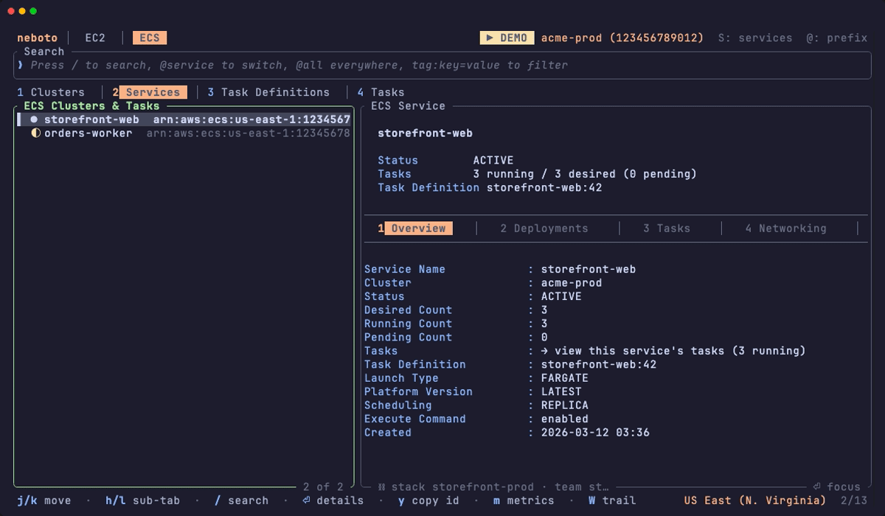
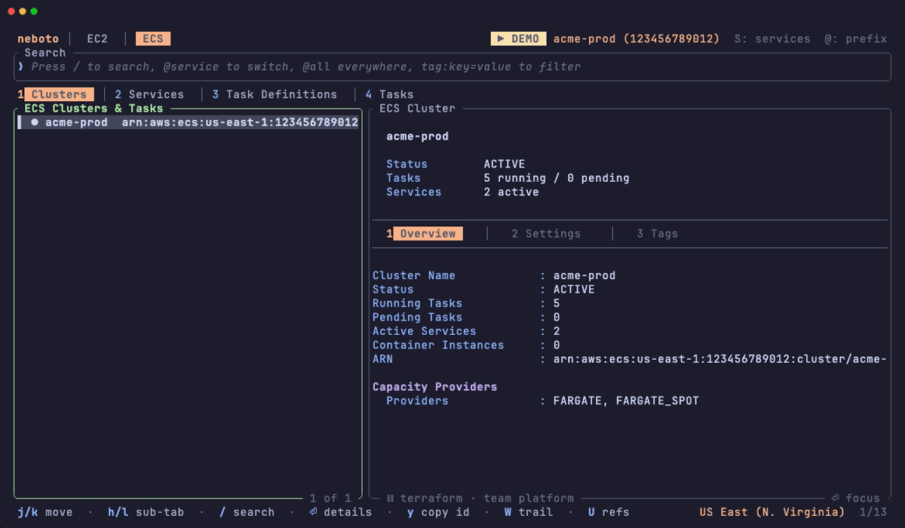
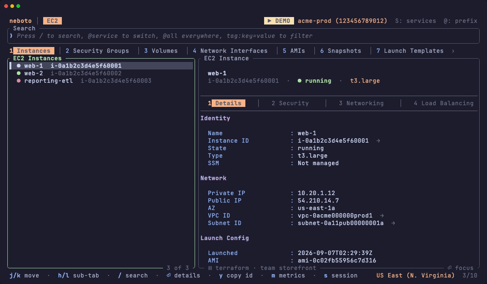
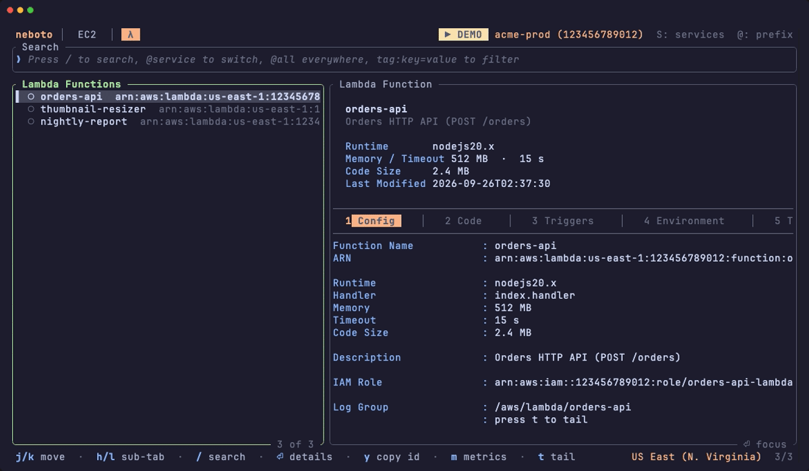
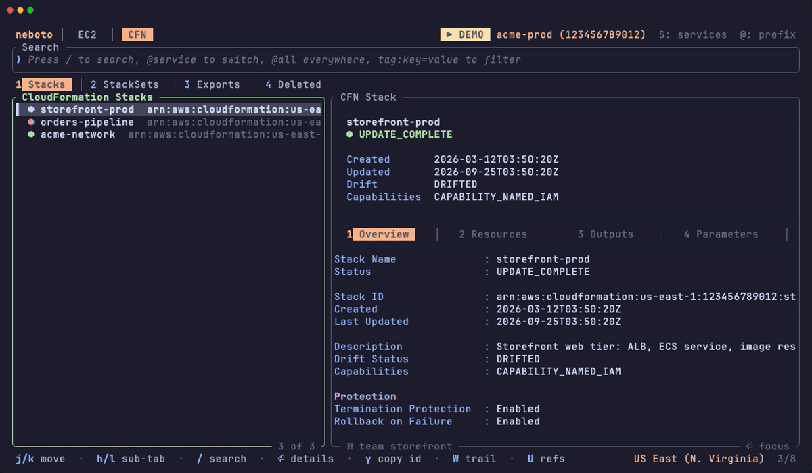

# neboto

A fast, keyboard-driven terminal UI for browsing AWS. **65 services**, rich
console-style detail panes, live log tailing, CloudWatch charts, and
cross-service link-following — all without leaving the terminal.

Built in Rust with [Ratatui](https://ratatui.rs/). Website and guide:
**[neboto.dev](https://neboto.dev)**.

<p align="center">
  
</p>

<p align="center"><em>Recorded with <code>neboto --demo</code>. Nothing on screen is a real account.</em></p>

**Try it without an AWS account:** `neboto --demo` opens a made-up account
with a few problems planted in it (a failed ECS deploy, SSH open to the world,
a drifted CloudFormation stack) and makes no network calls.

**neboto is read-only.** It issues only `describe`/`list`/`get` calls. Nothing
it does can change your account, which is the point: it is safe to run against
production, and the IAM policy in [`PERMISSIONS.md`](./PERMISSIONS.md) is
auditably read-only. See [Why read-only](#why-read-only).

---

## Highlights

- **65 AWS services** behind an `@prefix` fuzzy search — `@ec2 web`, `@sh`,
  `@orgs`. Multi-resource services get numbered sub-tabs.
- **Console-style split detail panes** on ~160 resource types: fixed header,
  section tabs, scrollable body. Expensive sections load lazily on first view.
- **Follow the links** — press `Enter` on any ARN, id or reference to jump to
  that resource, across services and even across regions. Tracing a dependency
  chain is faster here than in the Console.
- **Live log tail** (`t`) and server-side **log search** (`f`) on log groups,
  Lambda, RDS, ECS tasks, WAF, CloudTrail, Step Functions, CodeBuild and more.
- **CloudWatch charts in the pane** (`m`) for 53 resource kinds, each with the
  right namespace and dimension set.
- **"Who changed this?"** (`W`) — a CloudTrail lens on *any* resource.
- **Multi-account** — switch profiles (`P`), or assume a role into an
  Organizations member account (`s`) scoped by a `ReadOnlyAccess` session
  policy so an assumed session provably cannot mutate.
- **Watch mode** (`w`) — auto-refresh without the list ever blanking.
- **Macros** (`,`) — record a navigation routine once, replay it with one key
  or from the CLI with `--macro`.
- **Themes** — 10 presets (light and dark) plus per-color overrides.
- **Export** (`X` / `Ctrl-X`) to JSON, CSV and/or Markdown (`export_formats`),
  including deep exports of a multi-row selection.

---

## See it in action

Each clip is one workflow against `neboto --demo`. Click for full size.

<table>
  <tr>
    <td width="50%"><a href="demo/scenes/follow-links.gif"></a><br><b>Follow the links.</b> <kbd>Enter</kbd> from an ECS service to its target group and load balancer, <kbd>Ctrl-O</kbd> back, then <kbd>N</kbd> for the service's effective network access.</td>
    <td width="50%"><a href="demo/scenes/who-changed.gif"></a><br><b>Who changed this?</b> SSH is open to the world; <kbd>W</kbd> shows who opened it and when.</td>
  </tr>
  <tr>
    <td width="50%"><a href="demo/scenes/lambda-tail.gif"></a><br><b>Tail the logs.</b> <kbd>t</kbd> live-tails a Lambda; <kbd>/</kbd> filters to the DynamoDB throttles.</td>
    <td width="50%"><a href="demo/scenes/stack-drift.gif"></a><br><b>Explain the drift.</b> A stack's Drift section names the changed property; <kbd>W</kbd> on that resource finds the console edit.</td>
  </tr>
</table>

---

## Install

Prebuilt binaries for Linux (x86_64, aarch64) and macOS (Intel, Apple
Silicon) are attached to every [GitHub release](https://github.com/neboto/neboto-tui/releases).

**Installer** — picks the right binary, verifies its SHA-256 and, when the
GitHub CLI is installed, its signed build provenance, and puts it in
`~/.local/bin`:

```bash
curl -fsSL https://raw.githubusercontent.com/neboto/neboto-tui/main/install.sh | sh
```

Prefer to read a script before running it? Download it first:

```bash
curl -fsSLO https://raw.githubusercontent.com/neboto/neboto-tui/main/install.sh && less install.sh && sh install.sh
```

**Or with [cargo-binstall](https://github.com/cargo-bins/cargo-binstall)**:

```bash
cargo binstall --git https://github.com/neboto/neboto-tui neboto
```

`NEBOTO_VERSION=v0.1.0` pins a version and `NEBOTO_INSTALL_DIR` changes the
destination. Or grab the tarball for your platform from the releases page and
put `neboto` anywhere on your `PATH`.

**Verify a download.** Every release archive carries a signed [build
provenance attestation](https://docs.github.com/en/actions/security-for-github-actions/using-artifact-attestations)
naming the commit and workflow that built it. With the GitHub CLI:

```bash
gh attestation verify neboto-aarch64-apple-darwin.tar.gz --repo neboto/neboto-tui
```

A tampered or substituted archive fails this check even if its `.sha256`
was replaced alongside it.

**From source** — needs a recent stable Rust toolchain:

```bash
cargo install --git https://github.com/neboto/neboto-tui
```

Or clone and build:

```bash
git clone https://github.com/neboto/neboto-tui.git && cd neboto-tui
cargo build --release && ./target/release/neboto
```

Either way you need configured AWS credentials. Optional companions: the
`aws` CLI + `session-manager-plugin` for SSM sessions (`s`), and a `$EDITOR`
for `e`. The user guide lives at [neboto.dev/guide](https://neboto.dev/guide/);
how releases are cut is in [`docs/RELEASING.md`](./docs/RELEASING.md).

### Command line

Every flag overrides the config file for that run only.

| Flag | Effect |
|---|---|
| `-s`, `--service <SERVICE>` | Open a service on startup (`ec2`, `s3`, `@cw`, …) |
| `-r`, `--region <REGION>` | Start in this region |
| `-p`, `--profile <PROFILE>` | Use this named AWS profile |
| `-w`, `--watch` | Start in watch mode (auto-refresh) |
| `-m`, `--macro <NAME>` | Run a saved macro on startup |
| `--theme <THEME>` | Color preset (see [Themes](#themes)) |
| `--show-keys` | Show each key and what it did in a corner box, for recordings and screen shares |
| `--endpoint-url <URL>` | Point at a local emulator |
| `--demo` | Browse a made-up account offline — no credentials, no network |
| `--no-update-check` | Skip the daily check for a newer release (see [Update check](#update-check)) |
| `--banner` / `--no-banner` | Show or hide the ASCII banner |

With no arguments and no `default_service` configured, neboto shows a welcome
splash and loads nothing until you pick a service — so startup is instant.

### Scripts and agents

Subcommands run once and print instead of opening the TUI. They make the same
read-only calls, so they're safe to hand to a script or an AI agent: nothing
neboto can call changes an account.

```sh
neboto services                                   # every @prefix it knows
neboto ls @ec2                                    # all EC2 resources
neboto ls @ec2 -t volume --state available        # unattached EBS volumes
neboto ls @iam -t role -f 'deploy'                # IAM roles, fuzzy-matched
neboto ls @ecs -f 'tag:team=storefront' -o md     # a Markdown table
neboto ls @lambda --demo -o json | jq '.resources[].name'
neboto get @lambda orders-api                     # every detail-pane section
neboto get @iam deploy-role --section permissions -o json
neboto get @ec2 web-1 web-2 sg-0123abcd -o md     # several, one document
```

`ls` flags:

| Flag | Effect |
|---|---|
| `-t`, `--type <TYPE>` | Only this resource type — the type column's text or its last word(s): `"Security Group"`, `role`, `role\|policy` |
| `-f`, `--filter <QUERY>` | The TUI's search: fuzzy text plus exact `tag:key[=value]` terms |
| `--state <STATE>` | Only rows in this state (`running`, `available`, …) |
| `--hide-noise` | Drop AWS-managed defaults and other noise rows (the TUI's `a`) |
| `--limit <N>` | At most N rows |
| `-o`, `--output <FORMAT>` | `table` (default on a terminal), `json` (default when piped), `md`, `csv` |

`get <@svc> <ID|NAME>...` prints what the detail pane shows — every section,
the lazily-fetched ones included — for up to 50 resources. A resource is
matched by exact id (or ARN, where that's its id), then exact name.

| Flag | Effect |
|---|---|
| `-t`, `--type <TYPE>` | Pick between resources that share a name (an ECS service and its task definition), as in `ls` |
| `--section <NAME>` | Only this section, any case; repeatable. The other sections' data isn't fetched |
| `--wait <SECS>` | How long to wait for slow sections (default 60); anything still loading prints as not loaded, with a note on stderr |

**To compare two resources**, diff two `get`s. Both come out with the same
sections in the same order, so the diff lines up:

```sh
diff <(neboto get @lambda orders-api-prod -o md) <(neboto get @lambda orders-api-staging -o md)
```

`--section` narrows it to what you care about, and any diff tool works
(`delta`, `vimdiff`, `git diff --no-index`).

Across accounts or regions, give each side its own `-p` / `-r`. Rows that
carry the account id or region would differ on every line, so swap those out
first:

```sh
norm() { sed -e "s/$1/ACCOUNT/g" -e "s/$2/REGION/g"; }
neboto get @lambda orders-api -p prod    -o md | norm 111111111111 ap-southeast-2 > prod.md
neboto get @lambda orders-api -p staging -o md | norm 222222222222 ap-southeast-2 > staging.md
diff prod.md staging.md
```

The two runs here go one after the other. With `<(…)` they run at once,
which means two credential prompts at the same time if both profiles use a
prompting `credential_process`. Each side matches the id or name in its own
account. For an Organizations member account, use a profile that assumes into
it (`role_arn` + `source_profile`); the CLI doesn't assume org roles itself.

**For AI agents:** [`skills/neboto/SKILL.md`](skills/neboto/SKILL.md) teaches
an agent the commands, output shapes and exit codes. For Claude Code, copy it
to `~/.claude/skills/neboto/SKILL.md`:

```sh
mkdir -p ~/.claude/skills/neboto
curl -fsSL https://raw.githubusercontent.com/neboto/neboto-tui/main/skills/neboto/SKILL.md \
  -o ~/.claude/skills/neboto/SKILL.md
```

`-r`, `-p`, `--endpoint-url`, `--demo` and `-o` work on every subcommand.
JSON is one document carrying `"schema": "neboto/v1"`: `ls` prints `{schema,
service, region, count, resources: [...]}`; `get` prints `{schema, service,
region, resource, sections, tags}` for one resource, and `{…, count,
resources: [...]}` for several. Section rows are the pane's `key: value`
rows — readable labels and formatted values, not raw API fields — and a
section that never loaded is `null`. `get -o csv` is one `ID,Section,Key,Value`
row per detail row. Secret values are never fetched: the `x`/`Y` reveal has no
CLI equivalent. Warnings go to stderr. Exit codes: `0` success (including an
empty list), `1` an AWS error, `2` a bad service, region or section, or a
resource that isn't there or is ambiguous. Unlike the TUI, an unknown region
or profile is an error rather than a fallback, so a script never gets another
account's answer.

#### Output contract

What a script can rely on, and what it can't:

- **Stable:** the flags; the JSON envelopes above; each `ls` row's `type`,
  `id`, `name`, `state` and `tags`; `get`'s `resource` object and `tags`; the
  section *names* (`.sections.Permissions`); the resource type names; the
  service prefixes; the first four CSV columns; the exit codes. Removing or
  renaming any of these is a breaking change: the schema moves to
  `neboto/v2` and the release notes say so. Additions (a new section, type,
  service or flag) can come in any release.
- **Descriptive:** everything *inside* a section, and the extra per-type
  columns an `ls` row carries (`"Runtime"`, `"Memory"`, …). These are the
  pane, serialized: labels, units and grouping follow the TUI and can change
  in any release. Read them, don't hard-code paths into them. For
  field-level stability, the AWS API itself (`aws …` / an SDK) is the
  contract.
- **For people only:** `-o table` and `-o md`. Don't parse them.

The stable half is pinned by a test over [`src/headless/contract.json`](src/headless/contract.json),
so it can't change by accident.

---

## Layout

```
┌────────────────────────────────────────────────────────────────────────────┐
│  neboto │ EC2 │ VPC │ S3 │ IAM        ⇄ prod (123456789012)  ⦿ default  ‹› │
├─── Sub-tabs ───────────────────────────────────────────────────────────────┤
│  1 Instances  2 Security Groups  3 EBS  4 ENIs  5 AMIs  6 Snapshots  ›     │
├─── Search ─────────────────────────────────────────────────────────────────┤
│  ❯ @ec2 web                                                                │
├──────────────────────────┬─────────────────────────────────────────────────┤
│  Resource list (40%)     │  Split detail pane (60%)                        │
│                          │                                                 │
│  ● i-0abc123  web-srv    │  web-server-prod                                │
│    i-0def456  api-srv    │  i-0abc123def456  ·  ● running  ·  t3.medium    │
│                          ├─────────────────────────────────────────────────┤
│                          │  1 Details 2 Security 3 Networking 4 Storage …  │
│                          ├─────────────────────────────────────────────────┤
│                          │  Security Groups                                │
│                          │    Group              sg-0abc123  web-servers → │
│                          │    IAM Role           app-server-role         → │
├──────────────────────────┴─────────────────────────────────────────────────┤
│  j/k move  l details  / search  m metrics  t logs  W trail  ? help  q quit │
└────────────────────────────────────────────────────────────────────────────┘
```

A `→` marks a row you can press `Enter` on to follow. `Z` makes the detail pane
full-width; `\` flattens all sections into one scroll.

---

## Keybindings

`?` opens the in-app help, which is the authoritative list. The essentials:

### Context

| Key | Action |
|---|---|
| `S` / `R` / `P` | Service / region / profile picker (work from either pane) |
| `@` | Search bar seeded with `@`, for a fast service switch |
| `/` | Fuzzy search the current service |
| `r` / `F5` | Refresh — whole service from the list, just this resource from the detail pane |
| `w` | Watch mode (auto-refresh); `+` / `-` tune the interval |
| `,` | Macros — `⏎` run, `n` record, `,` again to stop recording |
| `` ` `` | Jump list (navigation history) |
| `B` / `'` | Bookmark this location / open bookmarks |
| `M` | Message history (past errors and toasts, `y`-copyable) |
| `\` | Toggle flat detail view (all sections in one scroll) |
| `b` / `?` / `q` | Banner / help / quit |

### List pane

| Key | Action |
|---|---|
| `j` `k` `↑` `↓` | Move |
| `gg` / `G` | Top / bottom |
| `Ctrl-d` / `Ctrl-u` | Half page |
| `l` `→` `⏎` | Open the detail pane |
| `⌫` `Ctrl-O` | Back through history |
| `Tab` / `Shift-Tab`, `1`–`9`, `0` | Switch sub-tab |
| `H` / `L` | Previous / next sub-tab (from either pane) |
| `a` | Hide noisy rows (defaults, automated snapshots, passed checks…) |
| `z` | Cycle sort — load order → name ↑ → name ↓ → state |
| `F` | Cycle a filter over the states present in this view |
| `V`, `J` / `K` | Visual row selection; `Ctrl-A` selects all |
| `y` | Copy the id/ARN — or the selection as a Markdown table |
| `C` | Copy an AWS CLI command for the resource — the read command, plus start/stop, force-deploy, scale and connect commands where they apply (copied, never run) |
| `X` / `Ctrl-X` | Export |

### Detail pane

| Key | Action |
|---|---|
| `j` `k`, `gg` / `G` | Scroll |
| `Tab` / `Shift-Tab`, `1`–`9` | Switch section |
| `H` / `L` | Previous / next sub-tab, staying in the detail pane |
| `[[` / `]]` | Previous / next group header |
| `l` `→` `⏎` | Follow the link under the cursor |
| `h` `←` `Esc` | Back to the list |
| `Ctrl-O` | Back through history |
| `/` | Filter the body text |
| `Ctrl-W` | Wrap long values onto continuation rows (toggle) |
| `y` / `c` | Copy the row, or the visual selection |
| `e` | Open in `$EDITOR` |
| `d` | Download (Lambda deployment package, invoice PDF) |
| `Z` | Full-width pane |

### In-pane views

Each takes over the keymap while open; `Esc` closes, `Z` goes full-width.

| Key | View |
|---|---|
| `m` | CloudWatch charts — `[` / `]` change the window, `r` refreshes |
| `t` | Live log tail — `[` / `]` widen the lookback, `s` flips to search |
| `f` | Log search (server-side filter pattern) · CloudTrail event filter · ECS/execution status filter |
| `W` | CloudTrail lens — who changed this resource; `[` / `]` widen to 90d, `a` includes reads |
| `o` | S3 object browser — folders, `/` filter, `V` version history incl. delete markers, `i` metadata, `v`/`e` preview, `d` download, `p` presigned URL; `t` on a `.tfstate` opens the Terraform state viewer (one row per instance, `Enter` jumps to the live resource) |
| `i` | DynamoDB item browser (Scan / Query, filters, GSI/LSI) · AgentCore memory session browser |
| `s` | SSM Session Manager · ECS Exec · assume an org member-account role |
| `x` / `Y` | Reveal / copy a secret or SSM parameter value (never cached); on a Route 53 record's Test answer section, `x` asks Route 53 what it answers (again on each press) |
| `O` | Open this resource in the AWS Console |

### Mouse

Everything on screen that names a key can be clicked. The keyboard is still
the faster route, but nothing needs it.

| Gesture | Does |
|---|---|
| Click | Select a row, switch a tab or section, open a picker from a badge, press a status-bar hint (`m metrics`, `W trail`…) |
| Double-click | `⏎`: open the detail pane, follow a link, confirm a picker row |
| Click a `→` | Follow that link |
| Click the `↑ vX.Y.Z` chip | Copy the upgrade command (shown when a newer release is out) |
| Click the detail pane's title bar | Full width (`Z`) |
| Wheel | Scroll the list, the detail body, a picker, or an in-pane view (the log tail pauses following, as `k` does) |
| Drag | Select a range of rows (then `y` copies it) |
| Right-click | Back (`Ctrl-O`); in a popup or an in-pane view (`m`, `t`, `o`, `i`, `W`, `U`, `N`), close it |
| Click outside a popup | Close it (`Esc`) |

neboto captures the mouse, so a plain drag selects rows rather than text. Hold
**Shift** while dragging for your terminal's own text selection (**Option** in
iTerm2).

---

## Search

```
@ec2                 switch to EC2
@ec2 web             switch to EC2 and fuzzy-search "web"
ec2:web              colon syntax, same thing
@all payments        search every warm cache entry, across services
tag:env=prod         exact tag filter (composes: tag:env=prod api)
arn:aws:iam::…       paste an ARN — it fuzzy-matches rather than erroring
```

Typing `@e` pops a completion dropdown; `Tab` completes to the first match.
Matching is fuzzy (Skim) with a score threshold, over every indexed field — ids,
names, IPs, CIDRs, AZs, tags, ARNs, usernames, emails, and per-service extras
like every secondary private IP on an ENI or every resource id in a GuardDuty
finding.

`@all` searches only what is already cached, and says how many services that
was — it never fires fetches. The service strip shows what it covered:
each service you've opened this session carries its match count
(`ECS 7 │ λ 1`), and `–` marks one whose cache has expired, so it wasn't
searched. Click a chip — or step through them with `Tab`/`Shift-Tab`
(`H`/`L`) — to show only that service's results, and `@all` to show them
all again; `z` sorts the results (name, state, or grouped by
service). On a result, `Enter` opens it in its own service; `l` peeks at it
in place, and `h` comes back to the same results.

---

## Services

65 services, grouped as the Console groups them. `S` opens a picker with the
same grouping.

| Category | Services (`@prefix`) |
|---|---|
| **Compute** | EC2 `@ec2` · Lambda `@lambda` · Auto Scaling `@asg` · Batch `@batch` · Elastic Beanstalk `@eb` · WorkSpaces `@workspaces` |
| **Containers** | ECS `@ecs` · EKS `@eks` · ECR `@ecr` |
| **Storage** | S3 `@s3` · EFS `@efs` · FSx `@fsx` · Backup `@backup` · Transfer Family `@transfer` |
| **Database** | RDS `@rds` · DynamoDB `@ddb` · ElastiCache `@elasticache` · DMS `@dms` |
| **Networking** | VPC `@vpc` · ELB `@elb` · Route 53 `@r53` · Route 53 Resolver `@resolver` · Route 53 Profiles `@profiles` · CloudFront `@cloudfront` · Transit Gateway `@tgw` · Direct Connect `@dx` · Global Accelerator `@ga` · API Gateway `@apigw` |
| **Security & Identity** | IAM `@iam` · Identity Center `@idc` · Cognito `@cognito` · KMS `@kms` · Secrets Manager `@secrets` · ACM `@acm` · WAF `@waf` · Network Firewall `@anfw` · GuardDuty `@gd` · Security Hub `@sh` · Inspector `@inspector` · Firewall Manager `@fms` |
| **Analytics** | Athena `@athena` · Glue `@glue` · Kinesis `@kinesis` · MSK `@msk` · Redshift `@redshift` · OpenSearch `@opensearch` |
| **ML & AI** | Bedrock `@bedrock` |
| **App Integration** | SQS/SNS `@sqs` · EventBridge `@events` · Step Functions `@sfn` · SES `@ses` |
| **Management** | CloudFormation `@cfn` · CloudWatch `@cw` · X-Ray `@xray` · CloudTrail `@cloudtrail` · AWS Config `@config` · Systems Manager `@ssm` · Organizations `@orgs` · Trusted Advisor `@ta` · Health `@health` · Service Quotas `@quotas` · Resource Explorer `@explorer` · Resource Groups `@resourcegroups` · RAM `@ram` · Control Tower `@controltower` |
| **Developer Tools** | CodeSuite `@code` |
| **Cost** | Cost Explorer `@cost` · Budgets `@budgets` · Invoices `@invoices` |

Per-service depth — which sub-tabs exist, which detail sections are lazy, which
metrics namespace `m` uses — lives in `src/aws/services/<service>.rs`, with the
non-obvious parts (API quirks, caps and their reasons, approaches that were
tried and failed) in [`docs/SERVICES.md`](./docs/SERVICES.md). It is
deliberately not duplicated here; that is how a README rots.

> **Cost note:** `@cost` uses AWS Cost Explorer, which bills ~$0.01 per API
> request and lags ~24h. neboto caches it for 6h; `r` forces a refresh.

---

## Multi-account

- **`P`** switches AWS profile (read from `~/.aws/config` and
  `~/.aws/credentials`), rebuilding every client and clearing caches.
- **`s`** on an Organizations account row assumes a role into that member
  account and re-points the whole app at it. Every assumed session is scoped
  with the AWS-managed `ReadOnlyAccess` **session policy**, so assumed
  credentials cannot mutate even if the underlying role is admin. Configure the
  role name(s) with `org_access_role` / `org_access_roles`; several roles opens
  a picker.
- `P` also offers **assume by account id**, for hopping to an account you
  cannot enumerate with `organizations:ListAccounts`.
- While assumed, the tab bar shows a `⇄ name (id)` badge, and exiting lands you
  back on the Organizations account list — so assume → inspect → exit → next
  account is a tight loop.

---

## Configuration

TOML, found at `$NEBOTO_CONFIG`, then `$XDG_CONFIG_HOME/neboto/config.toml`
(default `~/.config/neboto/config.toml`), then `~/.neboto.toml`. Every key is
optional; see [`config.example.toml`](./config.example.toml) for a commented
template.

| Key | Meaning |
|---|---|
| `default_service` | Load this service on startup (omit for the welcome splash) |
| `default_region`, `default_profile` | Where to start |
| `show_banner` | ASCII banner on startup |
| `watch`, `watch_interval` | Start in watch mode, and its cadence in seconds |
| `detail_flat` | Start with the flat all-sections detail view |
| `detail_wrap` | Start with long detail values wrapped onto continuation rows (`Ctrl-W` toggles) |
| `show_keys` | Show each key and what it did in a corner box (`--show-keys` for one run) |
| `export_formats` | Which files exports write: any of `"json"`, `"csv"`, `"md"` (default all three) |
| `export_dir` | Where exports go (default the working directory; `NEBOTO_EXPORT_DIR` overrides) |
| `session_launch` | Where SSM / ECS Exec sessions open: `"auto"` (default: tmux window → new terminal window → this terminal), `"window"` or `"inline"` (`--session-launch` for one run; see [Why read-only](#why-read-only)) |
| `theme`, `[theme_colors]` | Preset name and per-color overrides |
| `cache_ttl`, `[cache_ttls]` | Base cache freshness (seconds) and per-service overrides keyed by `@`-prefix |
| `org_access_role`, `org_access_roles` | Role name(s) for the member-account switch |
| `controltower_audit_account`, `controltower_audit_role` | The account holding the Control Tower Config aggregator (**quote the id** — a bare 12-digit number is a TOML integer) |
| `endpoint_url` | Point every client at a local emulator |
| `update_check` | Check once a day for a newer release (default `true`; see [Update check](#update-check)) |

A config file that fails to parse warns in the status bar at startup rather
than silently falling back to defaults.

### Update check

Once a day, neboto asks GitHub whether there's a newer release (an anonymous
`GET https://api.github.com/repos/neboto/neboto-tui/releases/latest`). If
there is, a `↑ vX.Y.Z` chip appears on the service strip; clicking it copies
the upgrade command and stops announcing that version. It is the only request
neboto makes that isn't to AWS. It sends nothing about you or your account,
and a failed request (offline, behind a proxy) is silent.

It's on by default. Turn it off with `update_check = false` in the config,
`--no-update-check` for one run, or `NEBOTO_NO_UPDATE_CHECK=1`. It never runs
under `--demo`, when `CI` is set, or for the `ls` / `get` subcommands. The
answer is cached in `$XDG_CACHE_HOME/neboto/update-check.json` (default
`~/.cache/…`).

### Credentials and region

The standard AWS chain: environment variables, `~/.aws/credentials`,
`~/.aws/config` (SSO profiles, IAM roles), then instance/task role. The startup
region comes from `AWS_DEFAULT_REGION` or the active profile; `R` switches at
runtime without a restart.

A `credential_process` that asks for something in the terminal works too, such
as granted with the `pass` keyring, where gpg's pinentry asks for your
passphrase. neboto runs it before the TUI starts. When it runs again later
(after `P`, or when the credentials expire), neboto steps aside until it
finishes. The screen stays put: a note replaces the status bar while it
runs, and a passphrase prompt draws over neboto and hands back when done.

### Themes

`dark` (default), `light`, `solarized-dark`, `solarized-light`, `gruvbox-dark`,
`gruvbox-light`, `dracula`, `nord`, `catppuccin-mocha`, `catppuccin-latte`.
Separators are optional and `mocha` / `latte` also resolve. Override individual
colors under `[theme_colors]` by palette field name (`#rrggbb` or an ANSI
name); a bad key or value warns at startup and is never fatal.

### `$EDITOR`

`e` opens the current resource in `$EDITOR` (falling back to `vim`). What it
opens depends on context: a fetched IAM policy document, a CloudFormation
template, an S3 object, a Step Functions payload, a raw finding JSON — or, by
default, the full detail-pane snapshot as JSON, so `e` always opens something
useful.

---

## IAM permissions

neboto needs read-only permissions for the services you actually browse. The
complete per-service action list is maintained in
[**`PERMISSIONS.md`**](./PERMISSIONS.md), which is updated in the same commit as
any change that adds an API call.

The quickest correct answer is the AWS-managed **`ReadOnlyAccess`** policy.
`PERMISSIONS.md` exists for accounts that need a narrower, auditable grant, and
it documents the handful of calls that deserve a second look — the reads that
are opt-in only (`secretsmanager:GetSecretValue`, `ssm:GetParameter` behind the
`x` reveal), the ones that cost money (`ce:GetCostAndUsage` at ~$0.01 a request,
`dynamodb:Scan`/`Query` consuming RCUs), the four S3 configuration reads whose
IAM action names don't match the `s3:GetBucket*` wildcard, and the
`sts:AssumeRole` behind the member-account switch.

---

## Why read-only

This is a design constraint, not a missing feature. Two concrete reasons it
stays that way:

1. The Organizations member-account switch pins assumed sessions to a
   `ReadOnlyAccess` session policy. Write actions would either fail silently
   cross-account or force that guarantee to be weakened.
2. A `PERMISSIONS.md` that documents a purely read-only footprint is a trust
   asset — security teams can approve neboto precisely *because* it cannot
   mutate. One gated write action changes that conversation permanently.

**Check it yourself in CloudTrail.** Every request neboto makes carries
`app/neboto` in its user agent, so your own trail shows exactly what it
called. In CloudTrail Lake or Athena, filter on `userAgent LIKE '%app/neboto%'`
and every row should be `readOnly = true`. (Event history can't filter on the
user agent; look up an event name, e.g. Lambda's `ListFunctions20150331`,
and check its `userAgent`.)

Where a mutation is genuinely what you want, **`C`** copies the ready-to-run AWS
CLI command for the selected resource, with the region, profile and ids filled
in: stop an instance, force an ECS redeployment, set an Auto Scaling group's
capacity, open an SSM session, write a kubeconfig. A picker groups the commands
as Inspect / Connect / Change and previews the exact text before copying.
Change commands are flagged, anything destructive (terminate, delete) is left
out, commands that take a value are prefilled with the current one, and a
visual selection of several instances becomes one `--instance-ids a b c`
command. You never reconstruct an ARN by hand, and neboto never holds the
ability to run it.

**The one exception: sessions.** `s` on an instance or ECS task opens an SSM
Session Manager or ECS Exec shell, through the `aws` CLI rather than the SDK.
It's always your keypress, and opening a session changes no resource, but a
shell on the box can change anything there. It's switched off while an Org
member-account role is assumed.

Sessions open in a new tmux window, else a new terminal window, else the
current terminal (the TUI suspends); config `session_launch` picks
`"window"` or `"inline"` instead. No credential is ever written into a
launched command, which would reach shell history, `ps` and the screen: on
static env keys a session runs in the current terminal, or under
`"window"` gets the keys through a temp file only you can read, which the new
shell sources and deletes. One leak is the AWS CLI's own and outside neboto's
reach: `session-manager-plugin` receives the session's `StartSession` response,
including its `TokenValue`, as a command-line argument, so it is visible in
`ps` while the session runs.

**Where the guarantee comes from.** Under an assumed member-account role,
AWS enforces it through the `ReadOnlyAccess` session policy. On your own
credentials it's enforced by the code and a CI check: every SDK call and every
action in `PERMISSIONS.md` must be a read. Nothing at runtime stops a write
there, so for a hard boundary run neboto on a read-only profile, for example
`ReadOnlyAccess` or the `PERMISSIONS.md` policy. If you don't want shells
either, add an explicit deny on `ssm:StartSession` and `ecs:ExecuteCommand`.

---

## Architecture

A tour for contributors lives in [`CLAUDE.md`](./CLAUDE.md); the project's own
vocabulary is defined in [`CONTEXT.md`](./CONTEXT.md), and non-obvious design
decisions in [`docs/adr/`](./docs/adr). The short version:

**Event-driven async core.** Terminal input is polled in a `spawn_blocking`
task; AWS calls run in spawned tasks and send results back over
`tokio::sync::mpsc`. The main loop is *check whether a load is needed → draw →
await the next event → mutate state*. The UI never blocks on AWS. All state
lives in one `App` struct; widgets render from `&App` and never mutate it.

**Streaming loads.** Services implement `list_resources_streaming()` and emit
partial batches, so a large account fills the list progressively instead of
waiting for the last page. A phase that fails sends a non-fatal warning and the
rest of the load continues.

**Split detail panes.** Each rich resource type declares its sections once, in
a descriptor table. Digit keys, `Tab` cycling, the flat view, export, bookmark
restore and the tab bar all derive from that one declaration, so they cannot
disagree. Expensive sections are lazy, fetched on first view through a single
generic store.

**Adding a service** is a documented 9-step recipe in `CLAUDE.md` — a new file
under `src/aws/services/`, an enum variant, a client, and registration in
`App::build_services()`.

```
src/
  main.rs          # entry, main loop, overlay dispatch
  app.rs           # App state, handle_event / handle_key, trigger_* fetches
  event.rs         # the Event enum
  lazy.rs          # Lazy / LazyMap / LazyStore — the lazy-section machinery
  macros.rs        # record and replay navigation sequences
  config.rs cli.rs export.rs editor.rs error.rs
  aws/
    service.rs resource.rs client.rs cache.rs region.rs pagination.rs
    services/      # one file per service
  search/          # fuzzy matcher + @prefix / tag: query parser
  ui/
    layout.rs theme.rs
    widgets/       # details_pane/, resource_list.rs, *_tabs.rs,
                   # metrics_overlay.rs, log_tail.rs, trail_lens.rs,
                   # s3_object_browser.rs, ddb_item_browser.rs, selectors
  harness_tests/   # offline wiring harness (no creds, no network)
```

---

## Development

```bash
cargo build          # debug
cargo test           # unit tests + the offline wiring harness
cargo clippy         # lint
cargo check          # fast type-check
python3 scripts/check-readonly.py   # the read-only guard CI runs
```

Contributions are welcome — [`CONTRIBUTING.md`](./CONTRIBUTING.md) has the
house rules, and [`SECURITY.md`](./SECURITY.md) how to report a vulnerability.

`cargo test` runs without AWS credentials or network. Alongside the unit tests,
an offline harness builds the app against a dead endpoint and injects mock
resources to verify that every service is registered, every split pane reaches
its renderer, and section ordering agrees across digit keys, `Tab` cycling and
the export snapshot. A new split pane needs a mock entry in
`src/harness_tests/mocks_*.rs` or the harness cannot see it.

### Local emulator

Point every client at floci or LocalStack via `endpoint_url` in config or
`AWS_ENDPOINT_URL` (the env var wins). Dummy
credentials are injected, S3 switches to path-style addressing, and the tab bar
shows a `⚙ host:port` badge.

```bash
COUNT=200 ./scripts/seed-floci.sh
AWS_ENDPOINT_URL=http://localhost:4566 cargo run
```

Open work is tracked in [GitHub Issues](https://github.com/neboto/neboto-tui/issues); settled design decisions are in [`docs/adr/`](./docs/adr).

---

## License

MIT — see [LICENSE](./LICENSE).
